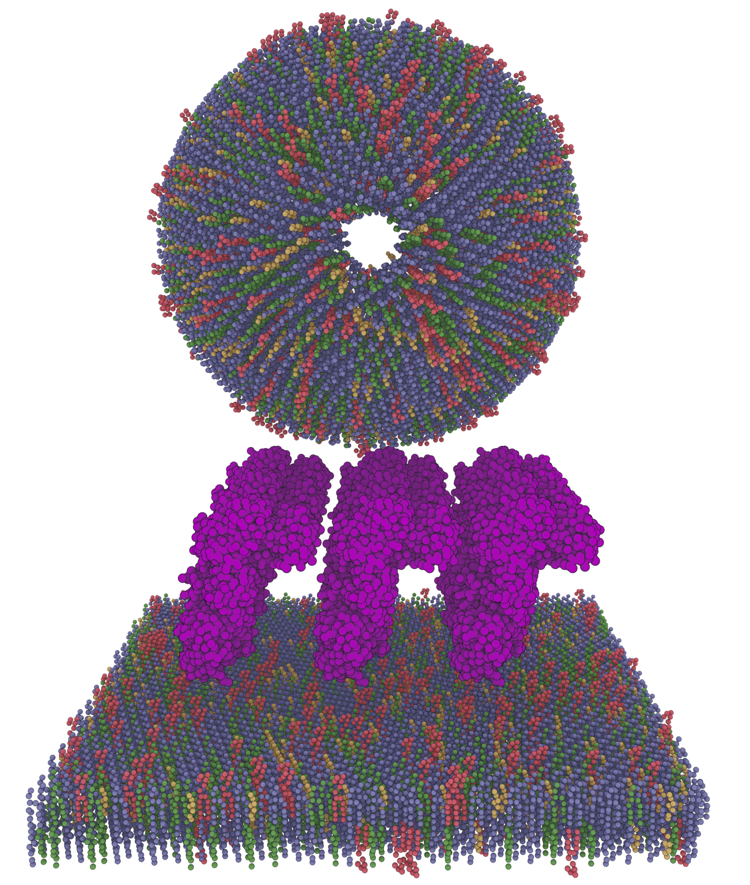

# MMAEVe - Membranes, Micelles, And Even Vesicles

MMAEVe is a simple python package for creating complex biomolecular systems. It can be used to distribute biomolecules about different surfaces, remove overlap between constructed system elements, write pdb files suitable for use as initial starting structures for Amber and Gromacs, and write Gromacs topology files. It is a simple but powerful tool that can be used to systematically generate complex structures.

## Installation

### Requirements

MMAEVe will work with python version >=3.5. Additionally, it requires the following packages:

```bash
numpy
scipy
pandas
```

### Installation via Conda

MMAEVe can be installed easily using the conda package manager. It is available via the conda-forge channel. To install, simply create an environment with a python version >=3.5 and run:

```bash
$ conda install -c conda-forge mmaeve
```

After installation, MMAEVe can be imported as a Python package.

## Usage

A comprehensive [tutorial](tutorial/tutorial.md) is provided. It serves as an introduction to how MMAEVe works and showcase of systems that it can be used to create.

## Example Systems

MMAEVe can be used to easily create complex systems. See the [tutorial](tutorial/tutorial.md) for usage. A couple examples of systems that can be created are shown below.

### Membrane-Bridging


### Covid Virion

