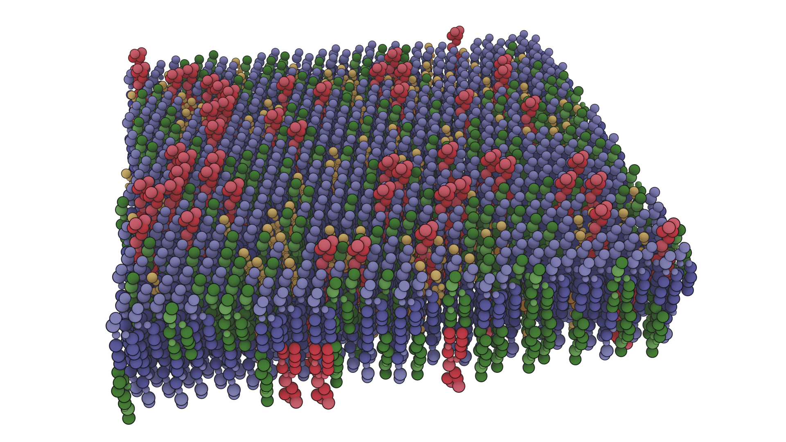

# MMAEVe Tutorial

The purpose of this tutorial is to give a comprehensive introduction to MMAEVe. It will cover all possible structure types that it can be used to build as well as all methods that can be used to build, modify, or write systems. See the ReadMe.md for installation instructions.

## Setting-up the Environment

The first step to building a system using MMAEVe is to set-up the environment. One directory,  `structures`, is required and another, `compositions`, is reccomended. For the purposes of this tutorial, both of these directories already exist and are populated with everything that will be needed to perform the tutorial.

The `structures` directory contains .pdb files that will serve as the building blocks of the system. The `compositions` directory contains plain-text "composition" files which describe the structure and proportions of the system as well as define "Head" and "Tail" atoms that are used to orient the system.

All output structures from the tutorial will be written to the `complexes` directory.

## Building a Simple Bilayer

The first system we will build is a simple bilayer.

The modules required for the tutorial are imported.
```python

import mmaeve as mav
import numpy as np
import copy 
```

The compositions of the membrane leaflets are imported.
```
upper_leaf_comp   = mav.read_comp("compositions/upper_leaf_comp")
lower_leaf_comp   = mav.read_comp("compositions/lower_leaf_comp")
```

This is a good time to investigate the contents of the two composition files.

upper\_leaf\_comp
```
POPC     POPS     CHOL     POP2
0.6      0.2      0.12     0.08
2-1-POPC 2-1-POPS 1-1-CHOL 4-1-POP2
7-1-POPC 7-1-POPS 7-1-CHOL 11-1-POP2
```

lower\_leaf\_comp
```
POPC     POPS     CHOL     POP2
0.6      0.2      0.12     0.08
7-1-POPC 7-1-POPS 7-1-CHOL 11-1-POP2
2-1-POPC 2-1-POPS 1-1-CHOL 4-1-POP2
```

Each file contains a space-deliminated column for each molecule that will be in the system. The first column entry corresponds to the PDB file prefix of of a file in the `structures` directory. If you look inside the `structures` directory you will see that `POPC.pdb POPS.pdb POP2.pdb CHOL.pdb` are all present. The second entry is the fraction of the system that the molecule will compose. The last two lines define which atom will serve as the "Head" and "Tail" of the molecule, respectively. The atom key is composed of the atom serial number, the residue number, and the residue name joined by a single '-'. Notice that the only difference between `upper_leaf_comp` and `lower_leaf_comp` is that the identities of the Head and Tail atoms are swapped. This is so that the lipids in each leaflet will be oriented in opposite directions.

The next step is to create two instances of `Lattice` which will correspond to each leaflet. Initializing any structure in MMAEVe requires mandatory positional arguments that describe the system. Lattice requires the width, length, height, number of molecules, and system composition. It should be noted that Å are the default units for MMAEVe.
```python
upper_leaf = mav.Lattice(200., 200., 23., 655, upper_leaf_comp)
lower_leaf = mav.Lattice(200., 200., 0., 655, lower_leaf_comp)
```

After the instance is created, all the information required to build the system has been gathered. The next step is to distribute the molecules to their assigned locations.
```python
upper_leaf.distribute()
lower_leaf.distribute()
```

Now the upper and lower leaflets of our bilayer have been created. However, we will need both of them to create a bilayer. To do this we combine the two leaflets into a single system.
```python
bilayer = upper_leaf + lower_leaf
```

We now have our bilayer! The next step is to write it to a file that we can visualize using a molecular visualization software.
```
bilayer.write_cif("complexes/bilayer.cif")
bilayer.write_pdb("complexes/bilayer.pdb")
```

MMAEVe currently supports writing two types of structure files, CIF and PDB. The former is written much more quickly than the latter making it the better option for initial construction of the system. The CIF files written by MMAEVe can be opened using PyMol however they were not read by VMD. I have not explored other visualization software. Further, I experience issues when trying to load CIF files into Blender using Brady Johnson's Molecular Nodes plugin. It seems that it relies on the Biotite package which does not like the way the CIF files are written. I do plan to address this in the future. Just be aware that usage of VMD or Molecular Nodes with require writing a PDB file.

A render of the system was created using Molecular Nodes and is shown below.




## Embedding Proteins in a Membrane

### Single Protein

A new composition is defined for creating the protein component of the system.

```python
porin_comp = mav.read_comp("compositions/porin_comp")
```

The previously created `bilayer` can be recycled for this system however it will be modified so copies of `bilayer` will be created using the `copy module`.
```python
bilayer0 = copy.deep_copy(bilayer)
```

Now the protein component of the system will be generated.
```python
porin = mav.Lattice(200., 200., 0., 1, porin_comp)
porin.distribute() 
```

The porin is then centered on the bilayer. This uses the `centroid` method and the `+` operator. `centroid` simply returns the centroid of the system as a (3, ) np.array of floats. The `+` operator has already been show as a method for concatenating systems. It can also be used to shift a system by a (3, ) np.array of floats.
```python
porin + (bilayer0.centroid() - porin.centroid())
```

The porin is centered on the system but this means that it is overlapping existing lipids within the system. The `remove_overlap` method can be utilized to remove any molecules that come within a cutoff of a system. The following will remove any lipids from `bilayer0` that have beads within 3.0 Å of `porin`.
```python
bilayer0.remove_overlap(porin, 3.0)
```

Finally the systems are combined and exported.
```python
porin_bilayer = bilayer0 + porin

porin_bilayer.write_cif("complexes/bilayer_porin.cif")
porin_bilayer.write_pdb("complexes/bilayer_porin.pdb")
```


### Multiple Proteins


## Lipid Nanodiscs

nanodisc_comp     = mav.read_comp("compositions/nanodisc_comp")
spike_comp        = mav.read_comp("compositions/spike_comp")
a2t_comp          = mav.read_comp("compositions/a2t_comp")
spike_coarse_comp = mav.read_comp("compositions/cspike_comp")

## Lipid Nanotubes

## An Array of Lipid Nanotubes

## Vesicles

## Periphreal Membrane-Binding Proteins around a Vesicle

## Membrane-Vesicle Junction

## Covid Virion

## GROMACS Topology Files
bilayer.write_gromacs_top("complexes/bilayer.top")

## AMBER-Safe PDB Files

## Reproducible Systems
