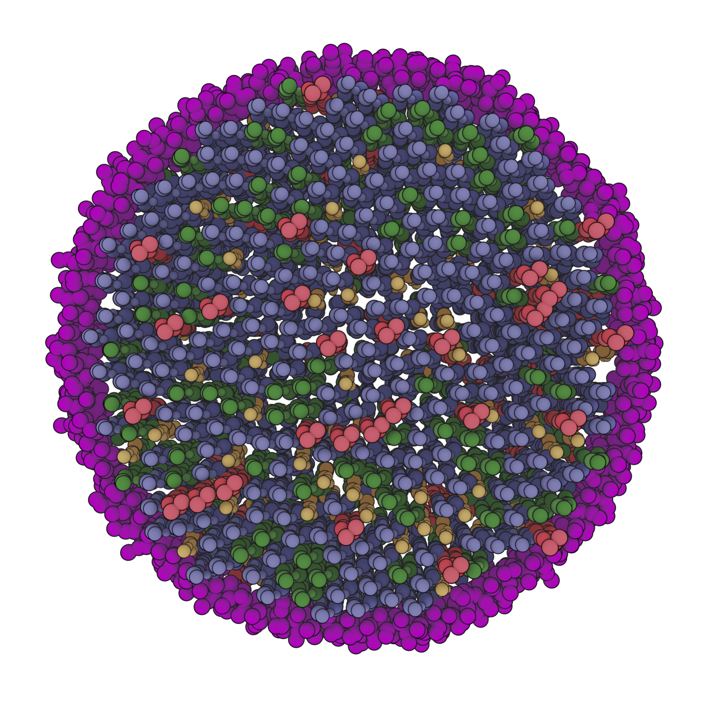
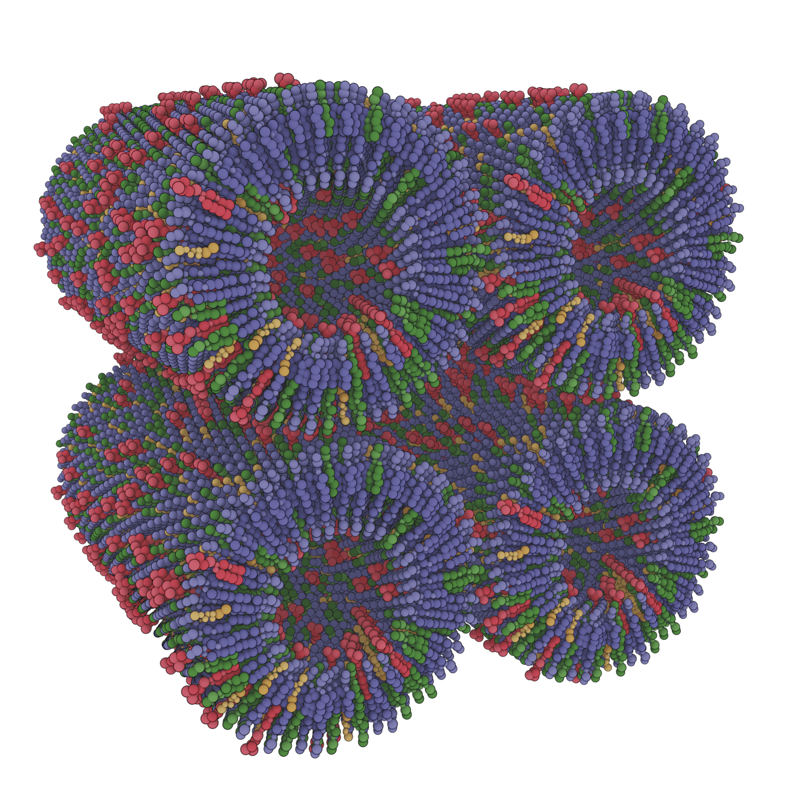
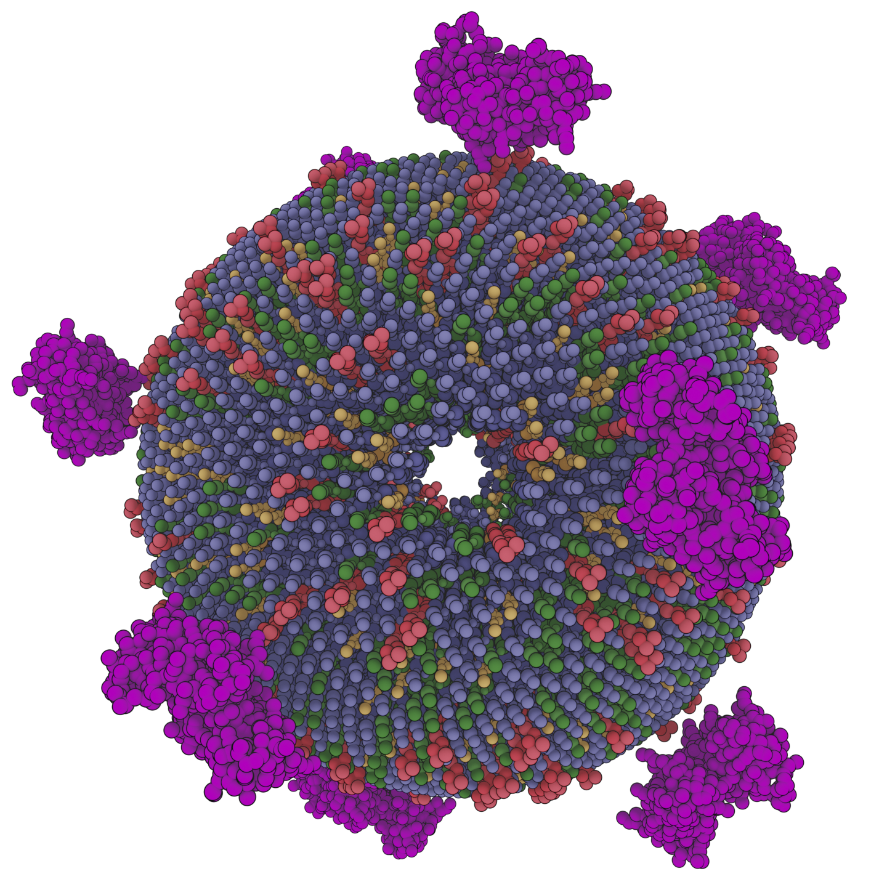

# MMAEVe Tutorial

The purpose of this tutorial is to give a comprehensive introduction to MMAEVe. It will cover all possible structure types that it can be used to build as well as all methods that can be used to build, modify, or write systems. See the [README.md](../README.md) for installation instructions.

## Setting-up the Environment

The first step to building a system using MMAEVe is to set-up the environment. One directory, `structures`, is required and another, `compositions`, is recommended. For the purposes of this tutorial, both directories already exist and are populated with everything that will be needed to perform the tutorial.

The `structures` directory contains .pdb files that will serve as the building blocks of the system. The `compositions` directory contains plain text "composition" files which describe the structure and proportions of the system as well as define "Head" and "Tail" atoms that are used to orient the system.

All output structures from the tutorial will be written to the `complexes` directory.

## Building a Simple Bilayer

The first system we will build is a simple bilayer.

The modules required for the tutorial are imported.
```python

import mmaeve as mav
import numpy as np
import copy 
```

The compositions of the membrane leaflets are imported.
```
upper_leaf_comp   = mav.read_comp("compositions/upper_leaf_comp")
lower_leaf_comp   = mav.read_comp("compositions/lower_leaf_comp")
```

This is a good time to investigate the contents of the two composition files.

upper\_leaf\_comp
```
POPC     POPS     CHOL     POP2
0.6      0.2      0.12     0.08
2-1-POPC 2-1-POPS 1-1-CHOL 4-1-POP2
7-1-POPC 7-1-POPS 7-1-CHOL 11-1-POP2
```

lower\_leaf\_comp
```
POPC     POPS     CHOL     POP2
0.6      0.2      0.12     0.08
7-1-POPC 7-1-POPS 7-1-CHOL 11-1-POP2
2-1-POPC 2-1-POPS 1-1-CHOL 4-1-POP2
```

Each file contains a space-deliminated column for each molecule that will be in the system. The first column entry corresponds to the PDB file prefix of of a file in the `structures` directory. If you look inside the `structures` directory you will see that `POPC.pdb POPS.pdb POP2.pdb CHOL.pdb` are all present. The second entry is the fraction of the system that the molecule will compose. The last two lines define which atom will serve as the "Head" and "Tail" of the molecule, respectively. The atom key is composed of the atom serial number, the residue number, and the residue name joined by a single '-'. Notice that the only difference between `upper_leaf_comp` and `lower_leaf_comp` is that the identities of the Head and Tail atoms are swapped. This is so that the lipids in each leaflet will be oriented in opposite directions.

The next step is to create two instances of `Lattice` which will correspond to each leaflet. Initializing any structure in MMAEVe requires mandatory positional arguments that describe the system. Lattice requires the width, length, height, number of molecules, and system composition. It should be noted that Å are the default units for MMAEVe.
```python
upper_leaf = mav.Lattice(200., 200., 23., 655, upper_leaf_comp)
lower_leaf = mav.Lattice(200., 200., 0., 655, lower_leaf_comp)
```

After the instance is created, all the information required to build the system has been gathered. The next step is to distribute the molecules to their assigned locations.
```python
upper_leaf.distribute()
lower_leaf.distribute()
```

Now the upper and lower leaflets of our bilayer have been created. However, we will need both of them to create a bilayer. To do this we combine the two leaflets into a single system.
```python
bilayer = upper_leaf + lower_leaf
```

We now have our bilayer! The next step is to write it to a file that we can visualize using a molecular visualization software.
```
bilayer.write_cif("complexes/bilayer.cif")
bilayer.write_pdb("complexes/bilayer.pdb")
```

MMAEVe currently supports writing two types of structure files, CIF and PDB. The former is written much more quickly than the latter making it the better option for initial construction of the system. The CIF files written by MMAEVe can be opened using PyMol however they were not read by VMD. I have not explored other visualization software. Further, I experience issues when trying to load CIF files into Blender using Brady Johnson's Molecular Nodes plugin. It seems that it relies on the Biotite package which does not like the way the CIF files are written. I do plan to address this in the future. Just be aware that usage of VMD or Molecular Nodes with require writing a PDB file.

A render of the system was created using Molecular Nodes and is shown below.


## Embedding Proteins in a Membrane

### Single Protein

A new composition is defined for creating the protein component of the system.
```python
porin_comp = mav.read_comp("compositions/porin_comp")
```

The previously created `bilayer` can be recycled for this system however it will be modified so copies of `bilayer` will be created using the `copy module`.
```python
bilayer0 = copy.deep_copy(bilayer)
```

Now the protein component of the system will be generated.
```python
porin = mav.Lattice(200., 200., 0., 1, porin_comp)
porin.distribute() 
```

The porin is then centered on the bilayer. This uses the `centroid` method and the `+` operator. `centroid` simply returns the centroid of the system as a (3, ) np.array of floats. The `+` operator has already been show as a method for concatenating systems. It can also be used to shift a system by a (3, ) np.array of floats.
```python
porin + (bilayer0.centroid() - porin.centroid())
```

The porin is centered on the system but this means that it is overlapping existing lipids within the system. The `remove_overlap` method can be utilized to remove any molecules that come within a cutoff of a system. It takes four arguments. The system that it operates on is the one that will be modified, `bilayer0` in this case. `porin_grid` is the system that is checked against for overlap. A cutoff distance is also provided. Additionally, an optional argument can be provided that specifies whether the atoms or centroids of the system that are checked against. Usually, the default atom-based method is used is sufficient. In this case, the porins have space at the center so the atom-based method alone is insufficient. So we apply the centroid-based method followed by the atom-based method.
```python
bilayer0.remove_overlap(porin_grid, 20.0, atom_based = False)
bilayer0.remove_overlap(porin, 3.0)
```

Finally the systems are combined and exported.
```python
porin_bilayer = bilayer0 + porin

porin_bilayer.write_cif("complexes/bilayer_porin.cif")
porin_bilayer.write_pdb("complexes/bilayer_porin.pdb")
```


### Multiple Proteins

No new compositions are needed for creating this system. Additionally, the same bilayer can be used again.
```python
bilayer1 = copy.deepcopy(bilayer)
```

This time the porins are distributed on the surface of a 150. x 150. Å grid. This grid is shifted 0. Å in the z-direction. 2 x 2 porins are distributed on the surface mapped to the 150. x 150. Å grid. The existing porin composition is used.
```python
porin_grid = mav.Grid(150., 150., 0., 2, 2, porin_comp)
porin_grid.distribute() 
```

The system is shifted.
```python
porin_grid + (bilayer1.centroid() - porin_grid.centroid())
```

Any lipids overlapping with the porins are removed.
```python
bilayer1.remove_overlap(porin_grid, 20.0, atom_based = False)
bilayer1.remove_overlap(porin_grid, 3.0, atom_based = True)
```

The systems are combined and exported.
```python
porin_grid_bilayer = bilayer1 + porin_grid

porin_grid_bilayer.write_cif("complexes/porin_grid_bilayer.cif")
porin_grid_bilayer.write_pdb("complexes/porin_grid_bilayer.pdb")
```


## Lipid Nanodiscs

A new composition is required to build the nanodisc as a protein component is required to act as a scaffold for the system.
``` python
nanodisc_comp = mav.read_comp("compositions/nanodisc_comp")
```

The leaflets of the system are generated using a `Disc`. The radius, height, molecule number, and composition are specified when the `Disc` is initialized.
``` python
upper_leaf = mav.Disc(95., 23., 464, upper_leaf_comp)
lower_leaf = mav.Disc(95.,  0., 464, lower_leaf_comp)

upper_leaf.distribute()
lower_leaf.distribute()

disc = upper_leaf + lower_leaf
```

Notice that the `distribute` method is not called. This is because selecting appropriate Head and Tail atoms for aligning the system is extremely difficult. Instead, MSP2N2 was pre-aligned using PyMol. The aligned structure can then be utilized. Not calling the `distribute` method preserves MSP2N2 in its original position. After initialization, it is then centered on `disc`.
``` python
msp2n2 = mav.Lattice(115., 115., 0., 1, nanodisc_comp)
msp2n2 + (disc.centroid() - msp2n2.centroid())
```

Final steps and writing the system.
``` python
disc.remove_overlap(msp2n2, radius = 3.0)
nanodisc = disc + msp2n2 

nanodisc.write_cif("complexes/nanodisc.cif")
nanodisc.write_pdb("complexes/nanodisc.pdb")
```



## Lipid Nanotube

A nanotube is constructed using two cylinders. The outer leaf is initialized with a radius of 75. Å, length of 300. Å, no shift in the z-direction, 2207 lipids, and the `upper_leaf_comp`. The inner leaf is initialized by specifying similar arguments.
```python
outer_leaf = mav.Cylinder(75., 300., 0., 2207, upper_leaf_comp)
inner_leaf = mav.Cylinder(52., 300., 0., 1606, lower_leaf_comp)

outer_leaf.distribute()
innter_leaf.distribute()
```

The system is combined and saved.
```python
nanotube = outer_leaf + inner_leaf

nanotube.write_cif("complexes/nanotube.cif")
nanotube.write_pdb("complexes/nanotube.pdb")
```


## Array of Lipid Nanotubes

Nanotubes have been utilized to control the deposition of inorganic substances. It might be interesting to investigate not just one nanotube but a configuration of nanotubes.

Copies are made of the existing nanotube for use in constructing the array.
```python
nanotube0 = copy.deepcopy(nanotube)
nanotube1 = copy.deepcopy(nanotube)
nanotube2 = copy.deepcopy(nanotube)
```

The nanotubes are shifted such that they are arranged in a grid.
```python
nanotube0 + np.array([165., 0., 0.])
nanotube1 + np.array([0., 165., 0.])
nanotube2 + np.array([165., 165., 0.])
```

The individual nanotubes are combined into a single system and the structure is saved.
```python
nanotube_array = nanotube + nanotube0 + nanotube1 + nanotube2

nanotube_array.write_cif("complexes/nanotube_array.cif")
nanotube_array.write_pdb("complexes/nanotube_array.pdb")
```



## Vesicles

Two spheres are used to create a vesicle. Spheres require that a radius, height, number of molecules, and a composition are specified. Optionally, a pore-radius can be specified. The pore radius is used to create pores along the principal axes and are a part of a procedure that can be used to equilibrate the number of lipids between the inner and outer leaflets of the vesicle.
```python
outer_leaf = mav.Sphere(125., 0., 3000, upper_leaf_comp, 
                    pore_radius = 20.0)
inner_leaf = mav.Sphere(100., 0., 1875, lower_leaf_comp,
                    pore_radius = 20.0)

outer_leaf.distribute()
inner_leaf.distribute()
```

```python
vesicle = outer_leaf + inner_leaf

vesicle.write_cif("complexes/vesicle.cif")
vesicle.write_pdb("complexes/vesicle.pdb")
```


## Peripheral Membrane-Binding Proteins around a Vesicle

We can also distribute proteins about a sphere. This can be useful for constructing systems containing peripheral membrane-binding proteins around a vesicle.
```python
a2_comp = mav.read_comp("compositions/a2_comp")
```

```python
a2 = mav.Sphere(165., 0., 10, a2_comp)
a2.distribute()
```

```python
vesi_a2 = vesicle + a2

vesi_a2.write_cif("complexes/vesi_a2.cif")
vesi_a2.write_pdb("complexes/vesi_a2.pdb")
```



## Membrane-Vesicle Junction

A new composition is required for the protein component, but the previous vesicle can be recycled.
```python
a2t_comp = mav.read_comp("compositions/a2t_comp")

vesicle0 = copy.deepcopy(vesicle)
```

A larger bilayer is necessary for constructing the system.
```python
upper_leaf = mav.Lattice(350., 350., 23., 2008, upper_leaf_comp)
lower_leaf = mav.Lattice(350., 350., 0., 2008, lower_leaf_comp)
upper_leaf.distribute()
lower_leaf.distribute()
bilayer = upper_leaf + lower_leaf

vesicle0 + (bilayer.centroid() - vesicle0.centroid())
vesicle0 + np.array([0., 0., 300.])
```

`Grid` is utilized for constructing the protein component of the system as it was utilized during when constructing the system with four porins.
```python
a2t = mav.Grid(240., 240., 0., 3, 3, a2t_comp)
a2t.distribute() 
a2t + (bilayer.centroid() - a2t.centroid())
a2t + np.array([0., 0., 100.])

vesi_bi_a2t = vesicle0 + bilayer + a2t

vesi_bi_a2t.write_cif("complexes/vesicle_bi_a2t.cif")
vesi_bi_a2t.write_pdb("complexes/vesicle_bi_a2t.pdb")
```


## Covid Virion

The final system we will construct is a covid-19 virion. Nothing new is introduced here. It is just to show off what MMAEVe is capable of.
```python
spike_comp = mav.read_comp("compositions/spike_comp")

outer_leaf = mav.Sphere(500., 0., 51475, upper_leaf_comp)
inner_leaf = mav.Sphere(475., 0., 46456, lower_leaf_comp)
outer_leaf.distribute()
inner_leaf.distribute()
vesicle = outer_leaf + inner_leaf

spike = mav.Sphere(600., 0., 75, spike_comp)
spike.distribute()

vesicle.remove_overlap(spike, 4.)

covid = spike + vesicle
covid.write_cif("complexes/covid_viron.cif")
covid.write_pdb("complexes/covid_viron.pdb")
```


## GROMACS Topology Files
Gromacs topology files with a count of each component of the system can be written. It does not include references to the required .itp files, this must be added by the user. It uses the .pdb file name as the molecule name. Ensure that the structure name matches that defined in any of the required itp files. The method only requires the name of the file to be written.

```python
bilayer.write_gromacs_top("complexes/bilayer.top")
```

## AMBER-Safe PDB Files

While all of the examples shown in this tutorial were of coarse-grained systems. MMAEVe is also perfectly capable of constructing all-atomic systems. Generating an appropriate .pdb for the Antechamber program of AMBER is straightforward when individual molecules are used. However, if protein complexes are utilized then each subunit should have a chain ID associated with it. This will ensure that Antechamber recognizes the protein complex subunits as individual molecules.

## Reproducible Systems

While not highlighted during any of the system constructions in the tutorial, it is possible to specify a random seed during the initialization of any system. It simply requires the specification of a `seed` argument. As shown below.

```python
upper_leaf = mav.Disc(95., 23., 464, upper_leaf_comp, seed = 0)
```

## Getting Help

Docustrings are provided for every class, function, and method in MMAEVe. Use Python's built-in `help()` function to retrieve the desired docustring.

## Notes

Please note that I was not particularly rigorous regarding the membrane compositions for the Porin and Covid systems. I know for a fact that the covid system is not a very faithful model; the membrane composition is not accurate and the M and E proteins were not included during system construction. I have not looked into the composition of membranes that Porins are found in. I preserved the same composition throughout the tutorial because it cut down on the number of required structures and made the process more convenient for me.

## References

Appropriate citations for all of the structures utilized for example system construction as well as references for the Software are

### Structures

#### Direct Links

1. All lipids were retrieved from the [Martini lipidome page](http://cgmartini.nl/index.php/force-field-parameters/lipids).
2. [The Sars-Cov-2 S protein](https://www.rcsb.org/structure/7VHK)
3. [Porin](https://www.rcsb.org/structure/2POR)
4. [Annexin A2](https://www.rcsb.org/structure/2HYW)
5. [Annexin A2/S100A10 Heterotetramer](https://www.rcsb.org/structure/4HRE)

#### Citations

1. T.A. Wassenaar, H.I. Ingólfsson, R.A. Böckmann, D.P. Tieleman, S.J. Marrink. Computational lipidomics with insane: a versatile tool for generating custom membranes for molecular simulations. JCTC, 11:2144–2155, 2015.
2. Weiss MS, Schulz GE. Structure of porin refined at 1.8 A resolution. J Mol Biol. 1992 Sep 20;227(2):493-509.
3. Shao C, Zhang F, Kemp MM, Linhardt RJ, Waisman DM, Head JF, Seaton BA. Crystallographic analysis of calcium-dependent heparin binding to annexin A2. J Biol Chem. 2006 Oct 20;281(42):31689-95.
4. Oh YS, Gao P, Lee KW, Ceglia I, Seo JS, Zhang X, Ahn JH, Chait BT, Patel DJ, Kim Y, Greengard P. SMARCA3, a chromatin-remodeling factor, is required for p11-dependent antidepressant action. Cell. 2013 Feb 14;152(4):831-43.


### Tools

#### Direct Links

1. Kroon P C, Grunewald F, Barnoud J, van Tilburg M, Souza P C T, Wassenaar T A, Marrink S J (2023) Martinize2 and Vermouth: Unified Framework for Topology Generation eLife 12:RP90627
2. Brady Johnston, Yuxuan Zhuang, Yinying Yao, William McCorkindale, Johannes Elferich, Patrick Kunzmann, Rich, Olivier Laprevote, Thibault Tubiana, Domenico Marson, James Hooker, Jessica A. Nash, & Joyce Kim. (2023). BradyAJohnston/MolecularNodes: v2.10.0 for Blender 3.5+ (v2.10.0). Zenodo.
3. Community, B. O. (2018). Blender - a 3D modelling and rendering package. Stichting Blender Foundation, Amsterdam.
4. Schrodinger, LLC. 2010. The PyMOL Molecular Graphics System, Version 2.0.

#### Citations

1. [Martinize](https://github.com/marrink-lab/vermouth-martinize)
2. [Molecular Nodes](https://github.com/BradyAJohnston/MolecularNodes)
3. [Blender](https://www.blender.org/)
4. [PyMol](https://github.com/schrodinger/pymol-open-source)
